<p align="center">
  
</p>


## Group Members

- Mak Loren Tsz Long 1155212355
- Leung Ting Yan Windsor 1155213897
- Woo Ryan 1155214118

## GitHub Repository

This repository contains the Python code, data processing workflow, exploratory data analysis, machine learning models, visualizations, and final report for predicting monthly PM2.5 concentrations in Hong Kong using weather and vehicle-related variables.

---

## Table of Contents

1. [Project Overview](#project-overview)
2. [Research Question](#research-question)
3. [Dataset Description](#dataset-description)
4. [Target Variable](#target-variable)
5. [Predictor Variables](#predictor-variables)
6. [Data Sources](#data-sources)
7. [Station Weighting Method](#station-weighting-method)
8. [Methodology](#methodology)
9. [Data Processing Workflow](#data-processing-workflow)
10. [Model Design](#model-design)
11. [Feature Sets](#feature-sets)
12. [Train-Test Strategy](#train-test-strategy)
13. [Evaluation Metrics](#evaluation-metrics)
14. [Exploratory Data Analysis](#exploratory-data-analysis)
15. [Model Results](#model-results)
16. [Actual vs Predicted Plots](#actual-vs-predicted-plots)
17. [Best Model Discussion](#best-model-discussion)
18. [Feature Importance](#feature-importance)
19. [Residual Analysis](#residual-analysis)
20. [Pros and Cons](#pros-and-cons)
21. [Potential Improvements](#potential-improvements)
22. [Societal Impact](#societal-impact)
23. [Conclusion](#conclusion)
24. [How to Run the Code](#how-to-run-the-code)
25. [Requirements](#requirements)
26. [Notes About Figure Paths](#notes-about-figure-paths)
27. [Acknowledgements](#acknowledgements)
28. [Disclaimer](#disclaimer)

---

## Project Overview

This project investigates whether monthly PM2.5 concentrations in Hong Kong can be predicted using meteorological conditions and vehicle-related factors.

PM2.5 refers to fine particulate matter with a diameter of 2.5 micrometers or smaller. It is an important air pollutant because it can affect public health, visibility, and environmental quality.

The project combines monthly data from 2015 to 2025, including:

1. PM2.5 air pollution data
2. Weather data
3. Vehicle registration data

The purpose of the project is not only to build a predictive model, but also to examine whether adding vehicle-related variables improves prediction accuracy beyond using weather variables alone.

In particular, this project studies whether changes in Hong Kong's vehicle fleet, including the growth of electric vehicles and changes in diesel vehicle share, are associated with changes in monthly PM2.5 levels.

---

## Research Question

The main research question is:

> Can monthly PM2.5 concentrations in Hong Kong be predicted using weather and vehicle-related variables, and does adding vehicle information improve prediction compared with weather-only models?

The project also considers the following questions:

- How strongly are PM2.5 levels related to weather conditions?
- Do vehicle-related variables improve model performance?
- Which machine learning model gives the best prediction accuracy?
- Which features are most important in predicting PM2.5?
- Is the rise of electric vehicles associated with lower PM2.5 levels?

---

## Dataset Description

The dataset covers monthly observations from:

```text
January 2015 to December 2025
```

After processing, each row represents one month.

The final merged dataset contains the following information:

- Weighted monthly PM2.5 concentration
- Monthly mean temperature
- Monthly mean relative humidity
- Monthly total rainfall
- Monthly total number of vehicles
- Monthly diesel vehicle share
- Monthly electric vehicle share

The processed dataset is generated by the Python script and saved as:

```text
pm25_project_outputs/merged_model_data.csv
```

---

## Target Variable

The target variable is:

```text
pm25_target
```

This variable represents the weighted monthly PM2.5 concentration in Hong Kong.

Because PM2.5 is measured at multiple monitoring stations, station-level readings were combined into a city-level PM2.5 indicator. Different weights were assigned to different stations based on their representativeness of Hong Kong's urban and residential environment.

---

## Predictor Variables

The predictor variables used in the models are:

| Variable | Description |
|---|---|
| `mean_temp` | Monthly mean temperature |
| `mean_humidity` | Monthly mean relative humidity |
| `rainfall` | Monthly total rainfall |
| `total_vehicles` | Total number of licensed vehicles |
| `diesel_share` | Share of diesel vehicles |
| `ev_share` | Share of electric vehicles |

These variables were selected because weather conditions influence pollutant concentration, while vehicle fleet structure may affect transport-related emissions.

---

## Data Sources

This project uses three main datasets.

### 1. Monthly Weather Data of Hong Kong

Source:

```text
https://www.hko.gov.hk/en/wxinfo/pastwx/mws/mws.htm
```

Weather variables include:

- Mean temperature
- Mean relative humidity
- Total rainfall

The weather file used by the Python script is:

```text
Weather data(2015-2025).xlsx
```

### 2. PM2.5 Concentration Data in Hong Kong

Sources:

```text
https://cd.epic.epd.gov.hk/EPICDI/air/station/?lang=en
https://statbase.org/data/hkg-air-pollution/
```

The PM2.5 file used by the Python script is:

```text
weighted-pm2.5.xlsx
```

### 3. Hong Kong Licensed Vehicles by Fuel Type

Source:

```text
https://webbsite.0xmd.com/dbpub/vefuel.asp?sort=&y=2025&m=12&simple=False&t=0
```

Vehicle variables include:

- Total vehicles
- Diesel share
- Electric vehicle share

The vehicle file used by the Python script is:

```text
vehicle_regression.xlsx
```

---

## Station Weighting Method

PM2.5 values were collected from different air quality monitoring stations across Hong Kong. Since some stations represent dense urban areas while others represent less populated or background locations, a weighted average was used to create the final PM2.5 target.

| Station | Weight | Reason |
|---|---:|---|
| CAUSEWAY BAY | 1.25 | Dense urban core |
| CENTRAL | 1.25 | Dense urban core |
| WESTERN | 1.25 | Dense urban core |
| EASTERN | 1.00 | Populated urban residential area |
| KWAI CHUNG | 1.00 | Dense industrial/residential area |
| KWUN TONG | 1.25 | Dense urban district |
| MONG KOK | 1.25 | Very dense urban district |
| NORTH | 1.00 | Populated new town area |
| SHAM SHUI PO | 1.25 | Dense urban district |
| SHATIN | 1.00 | Major new town |
| SOUTHERN | 0.75 | Lower density relative to urban core |
| TAI PO | 1.00 | Major residential new town |
| TAP MUN | 0.50 | Remote/background-like station |
| TSEUNG KWAN O | 1.00 | Major residential new town |
| TSUEN WAN | 1.00 | Major urban/residential district |
| TUEN MUN | 1.00 | Major residential district |
| TUNG CHUNG | 0.75 | Smaller or less representative historically |
| YUEN LONG | 1.00 | Major residential district |

The purpose of weighting is to make the PM2.5 target more representative of populated and urban parts of Hong Kong.

---

## Methodology

The project uses supervised machine learning regression.

The overall methodology includes:

1. Loading PM2.5, weather, and vehicle datasets
2. Cleaning and standardizing column names
3. Converting all datasets into monthly date format
4. Merging datasets by date
5. Conducting exploratory data analysis
6. Creating three feature sets
7. Training regression models
8. Comparing models using test-set performance
9. Visualizing actual and predicted PM2.5 values
10. Interpreting feature importance or coefficients
11. Performing residual analysis

The analysis was implemented in Python using:

- `pandas`
- `numpy`
- `matplotlib`
- `seaborn`
- `scikit-learn`

---

## Data Processing Workflow

The full workflow is implemented in:

```text
SEEM3650 Group Project Code.py
```

### 1. Import Libraries

The code uses common data science and machine learning libraries:

```python
import pandas as pd
import numpy as np
import matplotlib.pyplot as plt
import seaborn as sns

from sklearn.linear_model import LinearRegression, Ridge
from sklearn.ensemble import RandomForestRegressor
from sklearn.pipeline import Pipeline
from sklearn.impute import SimpleImputer
from sklearn.preprocessing import StandardScaler
from sklearn.metrics import mean_absolute_error, mean_squared_error, r2_score
```

### 2. Load Data

The script loads three Excel files:

```python
PM25_FILE = Path("weighted-pm2.5.xlsx")
WEATHER_FILE = Path("Weather data(2015-2025).xlsx")
VEHICLE_FILE = Path("vehicle_regression.xlsx")
```

These files must be placed in the same directory as the Python script before running the code.

### 3. Clean Column Names

The function `clean_column_names()` standardizes column names by:

- removing extra spaces
- converting names to lowercase
- replacing special characters with underscores
- removing repeated underscores

This reduces errors during merging and modeling.

### 4. Process PM2.5 Data

The PM2.5 data is loaded in wide format and converted into long monthly format using `melt()`.

The code extracts year and month information, creates a monthly date column, and keeps the PM2.5 target variable:

```text
pm25_target
```

### 5. Process Weather Data

The weather Excel file contains multiple sheets by year. The script reads year-based sheets, extracts monthly weather variables, and standardizes them into:

```text
mean_temp
mean_humidity
rainfall
weather_pm25_station
```

### 6. Process Vehicle Data

The vehicle dataset is cleaned and converted into monthly format.

The main vehicle variables used are:

```text
total_vehicles
diesel_share
ev_share
```

### 7. Merge Datasets

The PM2.5, weather, and vehicle datasets are merged by the monthly `date` column.

The final merged dataset is saved to:

```text
pm25_project_outputs/merged_model_data.csv
```

### 8. Generate Visualizations

The code produces:

- PM2.5 trend plot
- Weather trend plot
- Vehicle trend plot
- Histograms
- Correlation heatmap
- Actual vs predicted plots
- Coefficient plot or feature importance plot
- Residual plot

All plot outputs are saved in:

```text
pm25_project_outputs/plots/
```

---

## Model Design

Three regression models are compared.

### Linear Regression

Linear Regression is used as the baseline model. It assumes a linear relationship between predictors and PM2.5.

Advantages:

- Easy to understand
- Easy to interpret
- Useful as a baseline model

Limitations:

- Cannot capture complex nonlinear relationships
- Sensitive to correlated predictors

### Ridge Regression

Ridge Regression is a regularized version of Linear Regression. It helps improve model stability when predictors are correlated.

Advantages:

- More stable than ordinary Linear Regression
- Useful when multicollinearity exists
- Still relatively interpretable

Limitations:

- Still assumes mostly linear relationships
- May not capture complex interactions

### Random Forest Regression

Random Forest Regression is a tree-based ensemble model. It can capture nonlinear relationships and interactions between variables.

Advantages:

- Captures nonlinear patterns
- Handles interactions between features
- Often performs well on tabular data
- Provides feature importance values

Limitations:

- Less directly interpretable than Linear Regression
- Can overfit if not evaluated carefully
- Performance may be limited by the small monthly sample size

---

## Feature Sets

Three feature sets are tested in the code.

### Feature Set A: WeatherOnly

```text
mean_temp
mean_humidity
rainfall
```

This tests whether meteorological conditions alone can predict PM2.5.

### Feature Set B: WeatherPlusVehicles

```text
mean_temp
mean_humidity
rainfall
total_vehicles
ev_share
```

This tests whether adding vehicle-related variables improves prediction.

### Feature Set C: WeatherPlusVehiclesPlusDiesel

```text
mean_temp
mean_humidity
rainfall
total_vehicles
diesel_share
ev_share
```

This tests whether diesel share provides additional information beyond total vehicles and EV share.

---

## Train-Test Strategy

Because the data is time-ordered, a chronological train-test split is used instead of a random split.

The code uses:

```python
TEST_RATIO = 0.2
```

This means the first 80% of the monthly observations are used for training, while the last 20% are used for testing.

According to the report, the split is approximately:

| Dataset | Period |
|---|---|
| Training set | January 2015 to September 2023 |
| Test set | October 2023 to December 2025 |

A random split was avoided because it could allow information from future months to leak into the training process.

---

## Evaluation Metrics

Three evaluation metrics are used.

### Mean Absolute Error

```text
MAE
```

MAE measures the average absolute difference between actual and predicted PM2.5 values.

Lower MAE means better prediction accuracy.

### Root Mean Squared Error

```text
RMSE
```

RMSE measures prediction error while giving larger errors more penalty.

Lower RMSE means better prediction accuracy.

### R-Squared

```text
R²
```

R² measures how much variation in PM2.5 is explained by the model.

Higher R² means better explanatory power.

The model results are saved to:

```text
pm25_project_outputs/model_results.csv
```

---

## Exploratory Data Analysis

### Weighted Monthly PM2.5 Trend

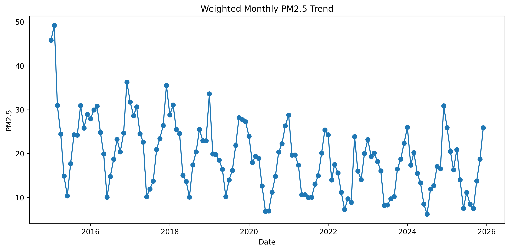

This plot shows the weighted monthly PM2.5 concentration in Hong Kong from 2015 to 2025.

The PM2.5 series shows clear seasonal fluctuations, with repeated peaks and troughs across the years. PM2.5 concentrations were generally higher and more volatile in the earlier part of the sample, while later years show lower average levels. However, several spikes still appear in the later period.

This suggests that PM2.5 is affected by both seasonal meteorological factors and longer-term structural changes.

---

### Weather Trends

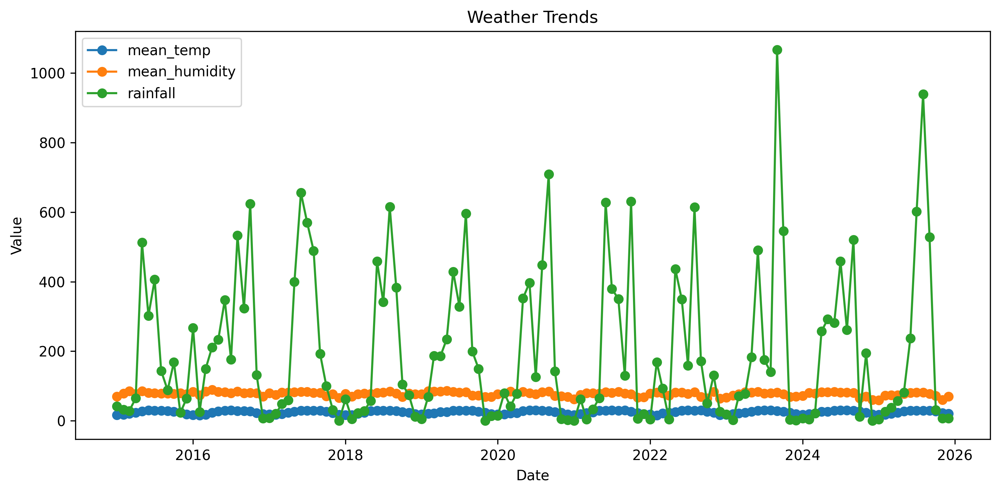

This plot shows monthly trends for:

- Mean temperature
- Mean humidity
- Rainfall

Temperature follows a clear seasonal pattern. Rainfall is highly volatile and contains some extreme monthly values. Humidity is more stable than rainfall, but it still changes seasonally.

These patterns indicate that weather variables are likely to be important predictors of monthly PM2.5.

---

### Vehicle Trends

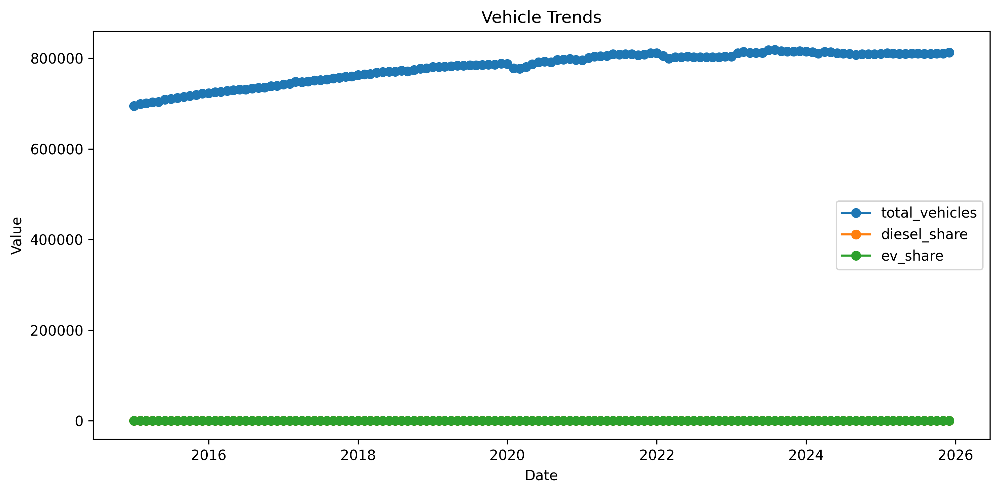

This plot shows vehicle-related trends from 2015 to 2025.

The total number of licensed vehicles generally increased over time. Diesel share generally decreased, while electric vehicle share increased noticeably in recent years.

This suggests that Hong Kong's vehicle fleet is gradually changing. However, since these vehicle variables also move over time, the relationship between vehicle variables and PM2.5 should be interpreted carefully.

---

### Histograms of Numeric Variables

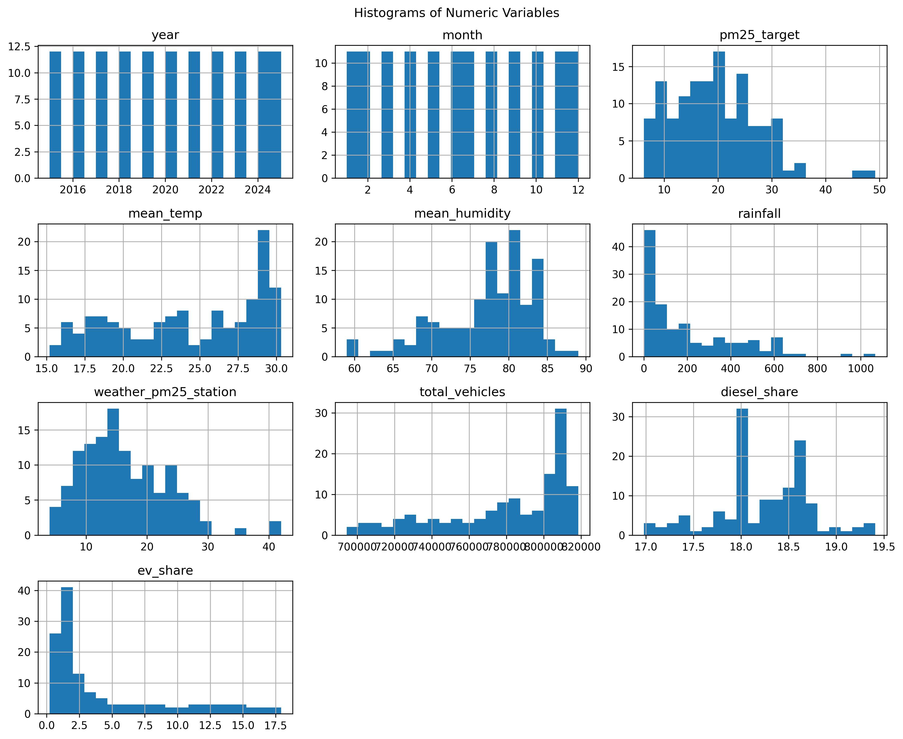

The histogram figure shows the distribution of the main numeric variables.

Key observations:

- PM2.5 is mostly concentrated in the lower-to-middle range.
- A few high PM2.5 values indicate pollution episodes.
- Rainfall is strongly right-skewed, with many low-rainfall months and a few very wet months.
- EV share is also right-skewed because electric vehicles were uncommon earlier but increased later.
- Temperature and humidity are more stable and seasonal.
- Total vehicles show a trend-based distribution because vehicle numbers changed over time.

These distributions suggest that nonlinear models may be useful.

---

### Correlation Heatmap

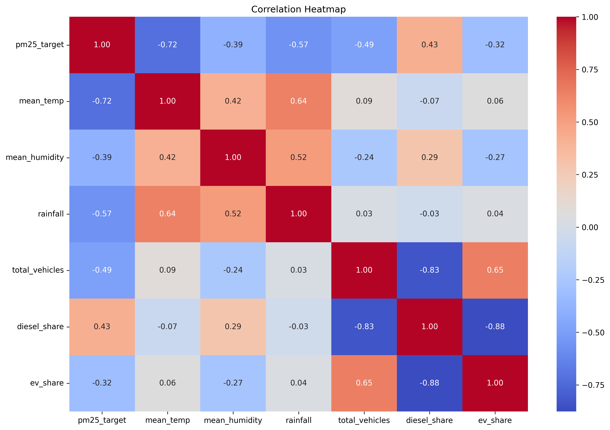

The correlation heatmap shows relationships among the variables.

Important correlations reported in the project include:

| Relationship | Correlation |
|---|---:|
| PM2.5 and mean temperature | -0.72 |
| PM2.5 and rainfall | -0.57 |
| PM2.5 and total vehicles | -0.49 |
| PM2.5 and EV share | -0.32 |
| PM2.5 and diesel share | 0.43 |
| Total vehicles and diesel share | -0.83 |
| Diesel share and EV share | -0.88 |
| Total vehicles and EV share | 0.65 |

The strong negative correlation between PM2.5 and temperature suggests that PM2.5 tends to be higher during cooler months.

The negative correlation between PM2.5 and rainfall suggests that rain may help reduce airborne particles.

The strong correlations among vehicle variables suggest multicollinearity. This is one reason Ridge Regression was included.

---

## Model Results

The table below summarizes model performance on the test set, based on the report.

| Model | Feature Set | RMSE | R² |
|---|---|---:|---:|
| Linear Regression | Weather Only | 4.945 | 0.374 |
| Ridge Regression | Weather Only | 4.947 | 0.373 |
| Random Forest | Weather Only | 5.334 | 0.271 |
| Linear Regression | Weather + Vehicles | 3.695 | 0.650 |
| Ridge Regression | Weather + Vehicles | 3.810 | 0.628 |
| Random Forest | Weather + Vehicles | 2.858 | 0.791 |
| Linear Regression | Weather + Vehicles + Diesel | 3.887 | 0.613 |
| Ridge Regression | Weather + Vehicles + Diesel | 3.992 | 0.592 |
| Random Forest | Weather + Vehicles + Diesel | 2.907 | 0.784 |

The best-performing model is:

```text
Random Forest Regression with Weather + Vehicles
```

It achieved:

```text
RMSE = 2.858
R² = 0.791
```

This indicates that the model explains approximately 79.1% of the variation in monthly PM2.5 during the test period.

---

## Actual vs Predicted Plots

The actual vs predicted plots compare observed PM2.5 values with model predictions during the test period.

In each plot:

- The actual line shows observed PM2.5 values.
- The predicted line shows model predictions.
- A better model has the predicted line closer to the actual line.

### Linear Regression: WeatherOnly

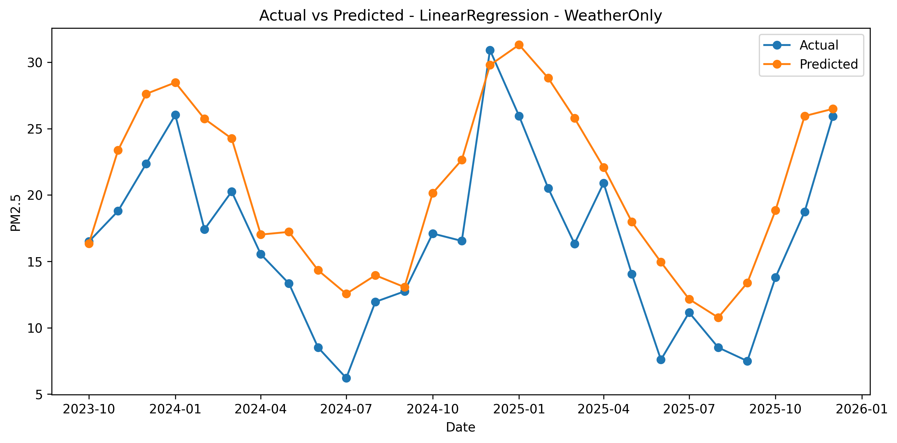

This model uses only weather variables. It captures the general seasonal pattern but misses many sharp changes. The predictions are smoother than the actual values, meaning the model cannot fully explain PM2.5 variation using weather alone.

---

### Ridge Regression: WeatherOnly

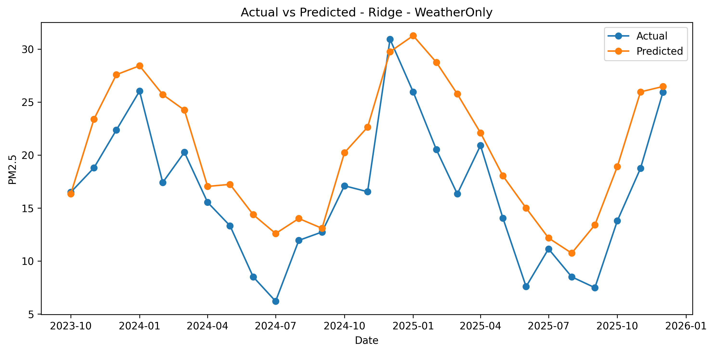

The Ridge weather-only model performs similarly to the Linear Regression weather-only model. Since only three weather variables are included, Ridge regularization does not create a major improvement.

---

### Random Forest: WeatherOnly

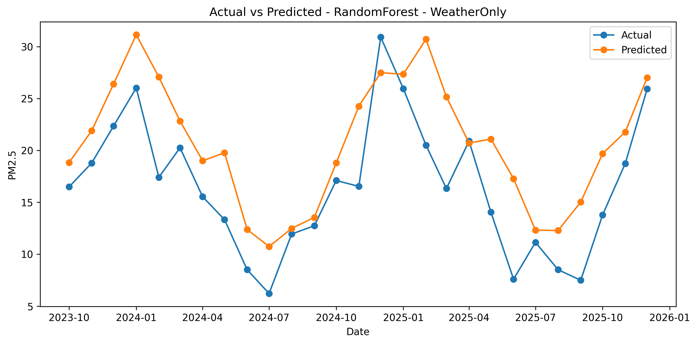

The Random Forest weather-only model captures some nonlinear weather effects, but it performs worse than models with vehicle variables. This suggests that weather alone does not contain enough information for the best prediction.

---

### Linear Regression: WeatherPlusVehicles

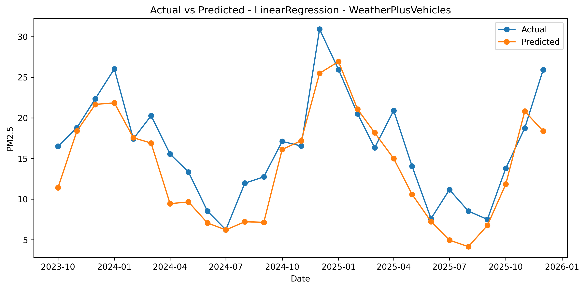

Adding vehicle variables improves Linear Regression performance. The predicted line follows the actual line more closely than the weather-only model.

This suggests that vehicle-related variables provide additional predictive information.

---

### Ridge Regression: WeatherPlusVehicles

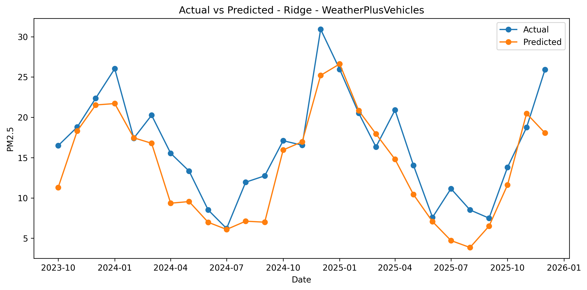

The Ridge Regression model with weather and vehicle variables also improves compared with the weather-only version.

Ridge Regression is useful here because vehicle variables are correlated with one another. The model is more stable than ordinary Linear Regression when predictors have multicollinearity.

---

### Random Forest: WeatherPlusVehicles

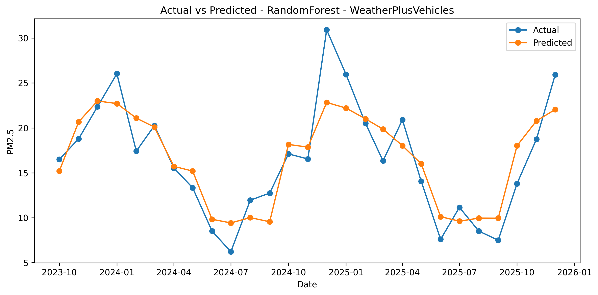

This is the best-performing model.

The Random Forest model with weather and vehicle variables follows the actual PM2.5 trend most closely. It captures many peaks and troughs better than the linear models.

However, it still underestimates or overestimates some months, especially unusual pollution episodes.

---

### Linear Regression: WeatherPlusVehiclesPlusDiesel

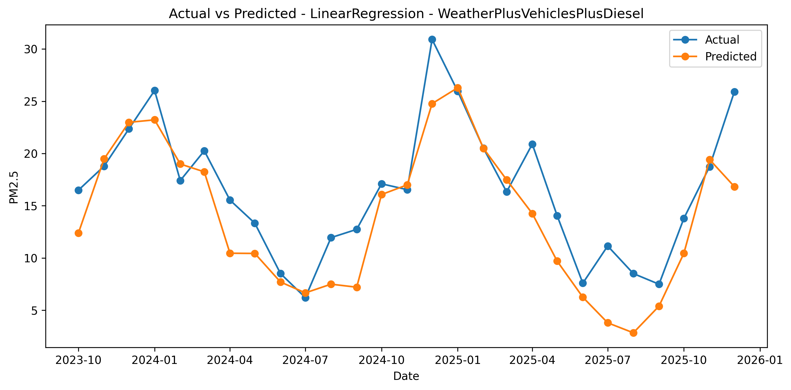

Adding diesel share does not improve Linear Regression performance. The model performs slightly worse than the WeatherPlusVehicles version.

This may happen because diesel share is strongly correlated with EV share and total vehicles, so it adds redundant information.

---

### Ridge Regression: WeatherPlusVehiclesPlusDiesel

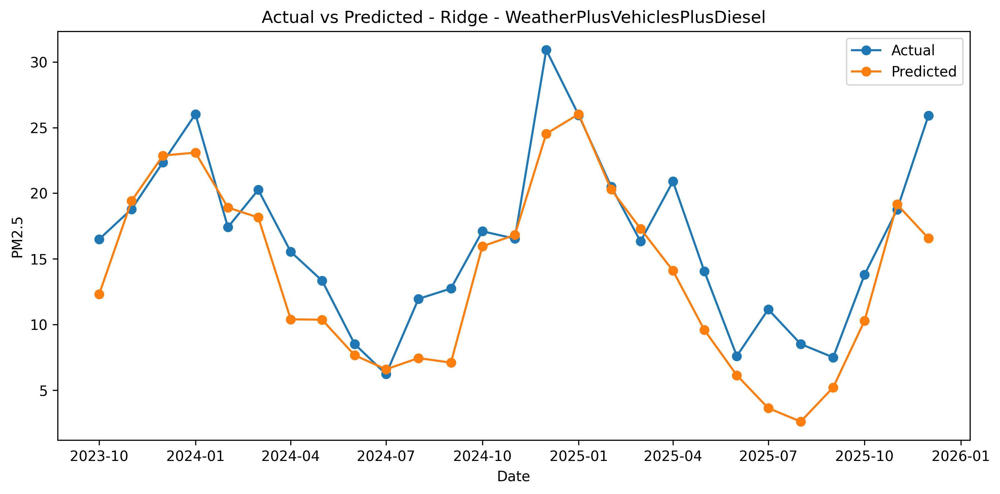

The Ridge Regression model with diesel share also performs slightly worse than the Ridge model without diesel share.

Although Ridge helps reduce multicollinearity problems, diesel share still does not provide enough additional information to improve prediction.

---

### Random Forest: WeatherPlusVehiclesPlusDiesel

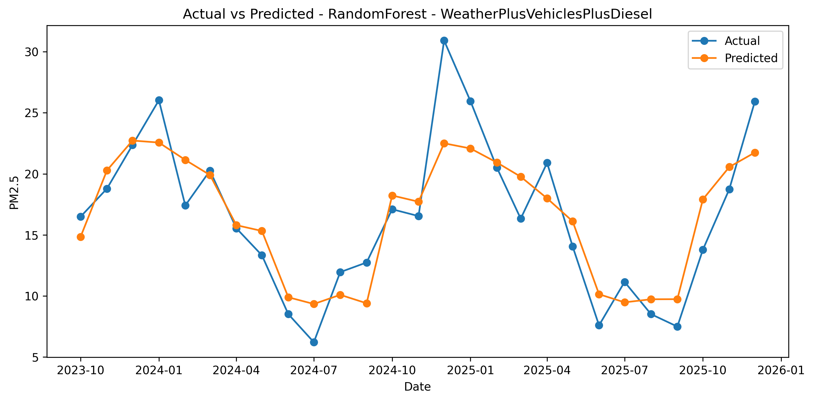

The Random Forest model with diesel share performs well but slightly worse than the Random Forest WeatherPlusVehicles model.

This supports the idea that diesel share is somewhat redundant when total vehicles and EV share are already included.

---

## Best Model Discussion

The best-performing model is:

```text
RandomForest with WeatherPlusVehicles
```

This model achieved:

```text
RMSE = 2.858
R² = 0.791
```

Random Forest performs best because it can capture nonlinear relationships and interactions between predictors. PM2.5 is influenced by complex factors, including seasonal weather conditions and changes in transport-related variables, so a flexible nonlinear model is more suitable than a purely linear model.

The inclusion of vehicle variables improved performance compared with weather-only models. However, adding diesel share did not improve the result. This is likely because diesel share is highly correlated with EV share and total vehicles, so it may introduce redundant information rather than useful new information.

Therefore, the final recommended model is:

```text
RandomForest with WeatherPlusVehicles
```

---

## Feature Importance

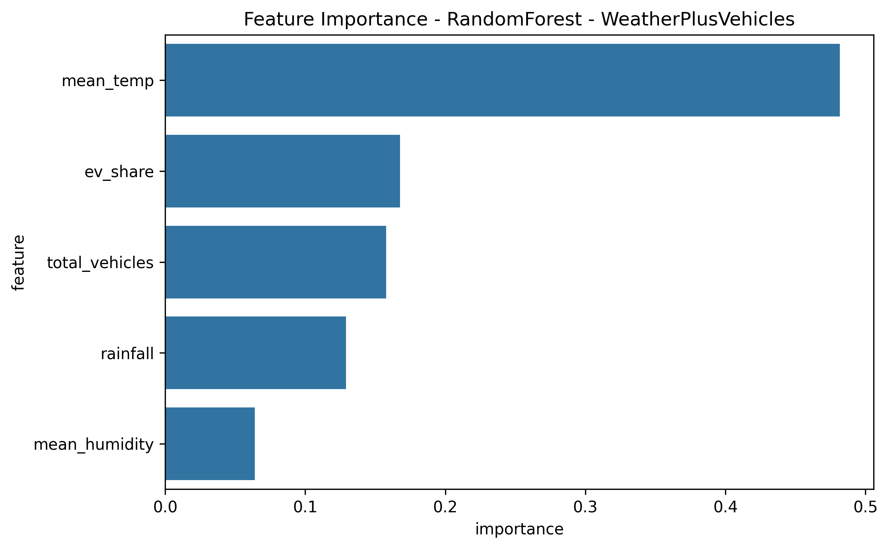

The feature importance plot comes from the best Random Forest model.

Approximate feature importance values reported in the project are:

| Feature | Importance |
|---|---:|
| `mean_temp` | 0.477 |
| `total_vehicles` | 0.128 |
| `rainfall` | 0.125 |
| `ev_share` | 0.075 |
| `mean_humidity` | 0.060 |

The most important predictor is mean temperature. This suggests that seasonal weather patterns are the strongest driver of monthly PM2.5 variation.

Total vehicles and rainfall are the next most important predictors. EV share and humidity have smaller but still meaningful contributions.

Overall, the results show that meteorological factors are the main predictors, while vehicle-related variables provide additional predictive value.

---

## Residual Analysis

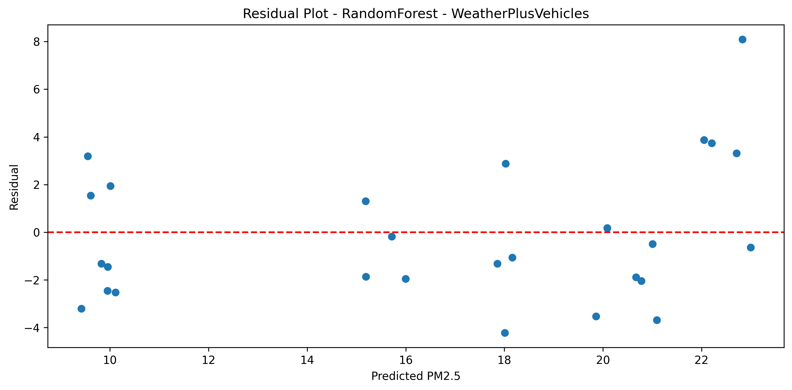

The residual plot shows the difference between actual and predicted PM2.5.

```text
Residual = Actual PM2.5 - Predicted PM2.5
```

A good model should have residuals randomly scattered around zero.

In this project, most residuals are close to zero, showing that the model is reasonably well calibrated. However, some residuals are large, meaning the model still fails to predict certain months accurately.

Possible reasons include missing variables such as:

- Wind speed
- Wind direction
- Regional pollution transport
- Industrial emissions
- Construction activity
- Short-term traffic conditions
- Unusual weather events
- Policy changes

Therefore, although the final model performs well, there is still room for improvement.

---

## Pros and Cons

### Pros

- Uses real-world environmental and transport data
- Combines air pollution prediction with transport policy relevance
- Uses multiple machine learning models for comparison
- Uses chronological train-test split suitable for time-ordered data
- Includes interpretable plots and metrics
- Tests whether vehicle variables improve PM2.5 prediction
- Produces a practical modeling pipeline
- Provides both predictive and environmental insights

### Cons

- Monthly data gives a relatively small sample size
- PM2.5 is affected by many factors not included in the dataset
- Station weighting may introduce subjectivity
- Vehicle counts do not directly measure actual road emissions
- EV share may be correlated with time trends rather than directly causing PM2.5 changes
- Results are predictive rather than causal
- Some pollution spikes remain difficult to predict

---

## Potential Improvements

This project could be improved in several ways.

### 1. Add More Environmental Variables

Future work could include:

- Wind speed
- Wind direction
- Atmospheric pressure
- Visibility
- Solar radiation
- Regional pollution transport indicators

### 2. Add More Traffic and Emission Variables

Useful additional variables could include:

- Road traffic volume
- Vehicle kilometers traveled
- Public transport ridership
- Industrial activity
- Construction activity
- Fuel consumption
- Roadside emission estimates

### 3. Improve PM2.5 Aggregation

The station weighting method could be improved by:

- Using population-based weights
- Using district-level exposure weights
- Comparing weighted and unweighted averages
- Testing sensitivity to different weighting schemes

### 4. Add Time-Series Features

Future models could include:

- Lagged PM2.5 values
- Month dummy variables
- Seasonal indicators
- Moving averages
- Long-term trend variables

### 5. Try More Models

Additional models could include:

- Lasso Regression
- Elastic Net Regression
- XGBoost
- LightGBM
- ARIMA
- SARIMAX

### 6. Run Robustness Checks

Robustness checks could include:

- Different train-test periods
- Equal-weight vs weighted PM2.5 target
- Removing extreme rainfall months
- Testing different Random Forest parameters
- Comparing results before and after the COVID-19 period

---

## Societal Impact

This project has social and environmental relevance because PM2.5 pollution affects public health. High PM2.5 exposure can harm respiratory and cardiovascular health, especially for vulnerable groups such as children, elderly people, and people with existing health conditions.

The project also connects air quality with transport transition. As Hong Kong adopts more electric vehicles, it is useful to study whether changes in vehicle composition are associated with cleaner air.

Traditional petrol and diesel vehicles emit pollutants directly into the urban environment. These emissions are distributed across many roads and are difficult to control at each individual source. Electric vehicles do not release tailpipe PM2.5 while driving, so increasing EV adoption may help improve roadside air quality.

However, electric vehicles should not be viewed as the only solution. PM2.5 is also affected by weather, regional pollution, industrial activity, power generation, construction, and other sources. Therefore, cleaner transport should be part of a broader air quality strategy.

The project can help:

- Support environmental awareness
- Encourage cleaner transport discussion
- Provide evidence for policy planning
- Demonstrate how machine learning can support public health and environmental research

---

## Conclusion

This project developed a machine learning framework to predict monthly PM2.5 concentrations in Hong Kong using weather and vehicle-related data from 2015 to 2025.

The results show that weather variables are very important predictors of PM2.5, especially mean temperature and rainfall. Adding vehicle-related variables improves model performance compared with weather-only models.

The best model is:

```text
RandomForest with WeatherPlusVehicles
```

It achieved:

```text
RMSE = 2.858
R² = 0.791
```

This model provides the best balance between prediction accuracy and practical interpretability.

Overall, the project shows that machine learning can be used to support air quality analysis and provide useful insights into the relationship between weather, vehicle trends, and PM2.5 concentrations.

---

## How to Run the Code

### 1. Clone the Repository

```bash
git clone https://github.com/ohryanw/SEEM3650-Group-Project.git
cd SEEM3650-Group-Project
```

### 2. Make Sure the Required Files Are Present

The Python script expects the following files to be in the same folder:

```text
SEEM3650 Group Project Code.py
weighted-pm2.5.xlsx
Weather data(2015-2025).xlsx
vehicle_regression.xlsx
```

### 3. Install Required Packages

Install the required Python packages:

```bash
pip install pandas numpy matplotlib seaborn scikit-learn openpyxl
```

The `openpyxl` package is needed because the project reads Excel `.xlsx` files.

### 4. Run the Python Script

Run:

```bash
python "SEEM3650 Group Project Code.py"
```

### 5. View Outputs

After running the script, a folder will be created automatically:

```text
pm25_project_outputs/
```

This folder contains:

```text
merged_model_data.csv
model_results.csv
```

The plots are saved in:

```text
pm25_project_outputs/plots/
```

Generated plot files include:

```text
pm25_trend.png
weather_trends.png
vehicle_trends.png
histograms.png
correlation_heatmap.png
actual_vs_pred_LinearRegression_WeatherOnly.png
actual_vs_pred_Ridge_WeatherOnly.png
actual_vs_pred_RandomForest_WeatherOnly.png
actual_vs_pred_LinearRegression_WeatherPlusVehicles.png
actual_vs_pred_Ridge_WeatherPlusVehicles.png
actual_vs_pred_RandomForest_WeatherPlusVehicles.png
actual_vs_pred_LinearRegression_WeatherPlusVehiclesPlusDiesel.png
actual_vs_pred_Ridge_WeatherPlusVehiclesPlusDiesel.png
actual_vs_pred_RandomForest_WeatherPlusVehiclesPlusDiesel.png
rf_importance_RandomForest_WeatherPlusVehicles.png
residual_plot_RandomForest_WeatherPlusVehicles.png
```

If a different model becomes the best model after rerunning the code, the feature importance or coefficient file name may change automatically depending on the selected best model.

---

The `pm25_project_outputs/` folder is created automatically when the Python script is run.

---

## Requirements

Recommended Python version:

```text
Python 3.9 or above
```

Required packages:

```text
pandas
numpy
matplotlib
seaborn
scikit-learn
openpyxl
```

Example `requirements.txt`:

```text
pandas
numpy
matplotlib
seaborn
scikit-learn
openpyxl
```

---

## Notes About Figure Paths

The figure file names in this README match the file names generated by the Python script.

The code saves figures to:

```text
pm25_project_outputs/plots/
```

Therefore, the image paths in this README use that folder path.

Example:

```markdown

```

If the images do not appear on GitHub, check that:

1. The script has been run successfully.
2. The folder `pm25_project_outputs/plots/` exists.
3. The figure file names have not been changed.
4. The file names match the README paths exactly, including capitalization.

---

## Acknowledgements

This project uses publicly available data from:

- Hong Kong Observatory
- Hong Kong Environmental Protection Department air quality data
- StatBase Hong Kong air pollution data
- Hong Kong licensed vehicle fuel-type data

This project was completed for SEEM3650 as a group project on environmental data analysis and machine learning.

---

## Disclaimer

This project is mainly predictive and exploratory. The results show associations between PM2.5, weather variables, and vehicle-related variables, but they do not prove direct causation.

In particular, the relationship between EV share and PM2.5 should be interpreted carefully because both variables change over time and may be influenced by other external factors.
```
